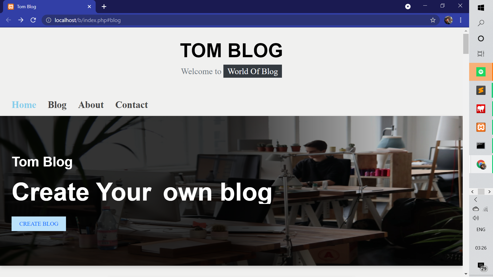
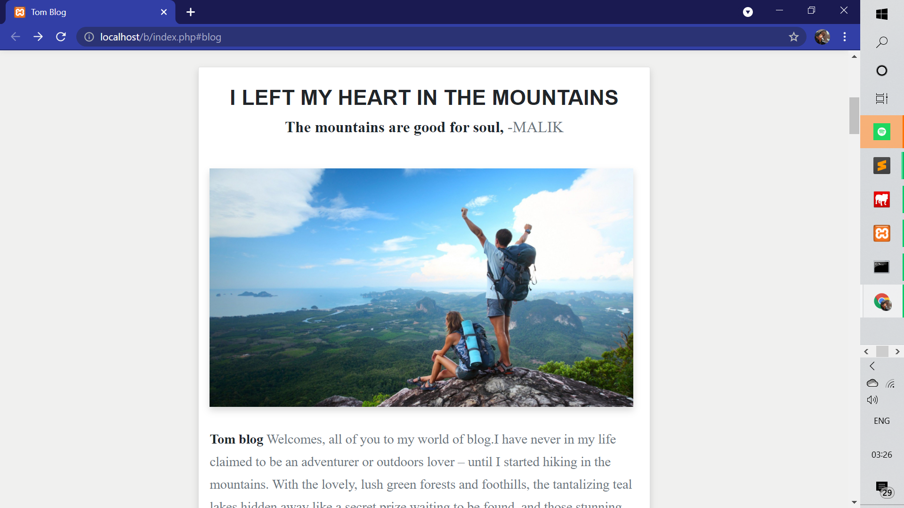

# blogging_website
blogging website for the intern academy.
task 1
# THE INTERN ACADEMY

 Hi I have developed this blogging website for <b>The Intern Academy</b> Task as Web Development Intern.

<h2 color="grey">BLOGGING WEBSITE </h2>
<li>Task 1:</li>
<li>This is a Blogging Website.</li>
<li>The project is done using HTML, CSS and a little JS.</li>
<li>The home page has the option to view all blogs ,like , comment and share. Also we can create blog.</li>
<li>The menu has home,blogs ,about and contact. The about link to The Intern Academy.</li>
<li>I have Hosted it in 000webhost.com</li>

  
  
 
 
  <h3> <b>Youtube Link:<b><a href="">here<a></h3>
   <h3> <b>Linkedin Post:<b><a href="">here<a></h3>
     <h3> <b>website :<b><a href="https://mrithulamaggietask-1.000webhostapp.com/">here<a></h3> 
        
        
    
<h3>FOLLOW:</h3>
<li><a href="https://www.linkedin.com/in/mrithula-v-aa01621b5/">LinkedIn</a>
<li><a href="https://www.facebook.com/mrithula.maggie.3">Facebook</a>
<li><a
href="https://www.youtube.com/channel/UC75HaQkxmGMk96OoEKrCtlQ">YouTube</a>

